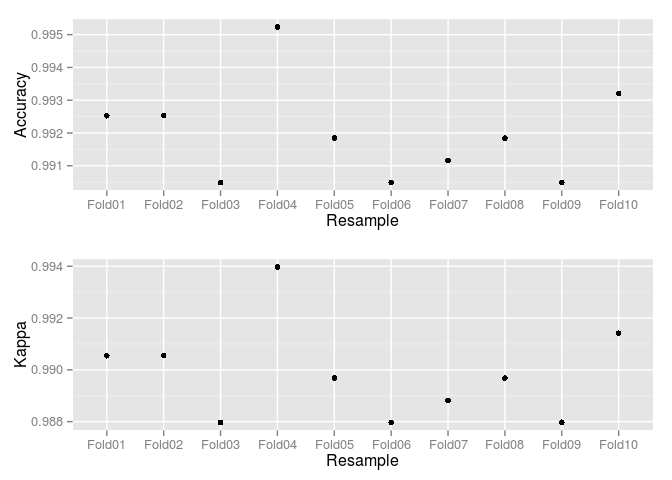
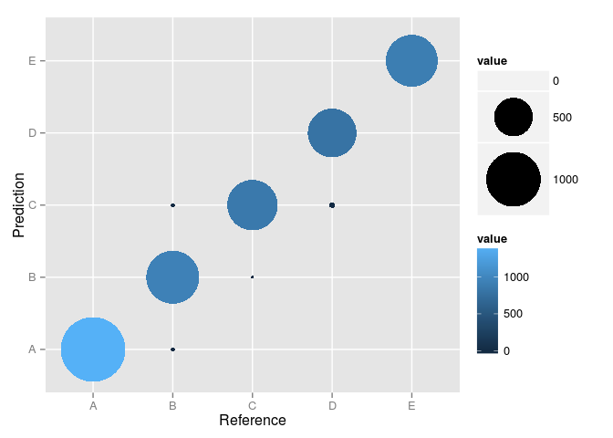
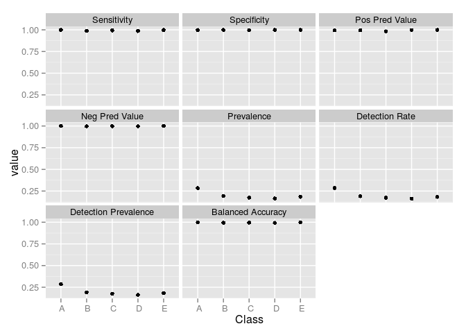

# Weight Lifting Wearables
Raymond C  
19/03/2015  

###Preliminaries
Load the necessary libraries and set the random seed.

```r
library(caret)
library(dplyr)
library(reshape2)
library(gridExtra)
set.seed(1935)
```

Load the training and validation data.

```r
train_dat <- read.csv("pml-training.csv")
test_dat <- read.csv("pml-testing.csv")
```

###Data Cleaning
Remove features that are not used in the validation dataset, i.e. the feature have NA for all values.

```r
excl_list <- character(0)
for (n in names(test_dat)){
  if (all(is.na(test_dat[n]))){
    excl_list <- c(excl_list, n)
  }
}
train_dat <- select(train_dat, -one_of(excl_list))
```

Remove features that are not relevant from the dataset. Feature X is the record sequence and should be removed. The problem is categorical hence temporal features are not revelant (Actually, the raw temporal data has been preprocessed already).

```r
train_dat <- select(train_dat, -X, -(raw_timestamp_part_1:num_window))
```

Convert all movement features to the numeric type.

```r
dyn_names <- names(train_dat)[2:(ncol(train_dat)-1)]
train_dat <- mutate_each_(train_dat, funs(as.numeric), 
                          dyn_names)
train_dat <- sample_n(train_dat, 1000)
```

###Parition Dataset
Partition dataset into training and testing sets. Test set will be used to compute out of sample error.

```r
inTrain <- createDataPartition(train_dat$classe, p = 0.75, 
                               list = FALSE)
train <- train_dat[inTrain,]
test <- train_dat[-inTrain,]
```

###Train the Model
Train the model using the random tree algorithm. Note that random tree does not require much preprocessing unlike regression. Cross validation is built into the model training.

```r
fitControl <- trainControl(method="cv", number=10)
modFit <- train(classe ~ ., method="rf", data=train, 
                 trControl = fitControl, prox=TRUE)
```

###Model Diagnostics
Plot K fold cross validation vs. accuracy and kappa with in the training dataset.

```r
p1 <- qplot(Resample, Accuracy, data=modFit$resample)
p2 <- qplot(Resample, Kappa, data=modFit$resample)
grid.arrange(p1, p2)
```

 

Plot of the confusion matrix.

```r
pred <- predict(modFit, test)
truth <- test$classe

cm <- confusionMatrix(pred, truth)
cm_tab <- melt(cm$table)
p <- qplot(Reference, Prediction, 
           color=value, size=value, data=cm_tab) +
  scale_size_area(max_size=25)
plot(p)
```

 

Plot of various metrics by prediction class.

```r
byClass <- mutate(melt(cm$byClass), Class = substr(Var1, 7, 8))
p <- ggplot(byClass, aes(x=Class, y=value, group=Var2)) + 
  geom_point() + facet_wrap(~ Var2)
plot(p)
```

 
Overall Performance


```r
print(cm$overall)
```

```
##       Accuracy          Kappa  AccuracyLower  AccuracyUpper   AccuracyNull 
##   9.112903e-01   8.878727e-01   8.687735e-01   9.435699e-01   2.701613e-01 
## AccuracyPValue  McnemarPValue 
##  5.808661e-101            NaN
```

